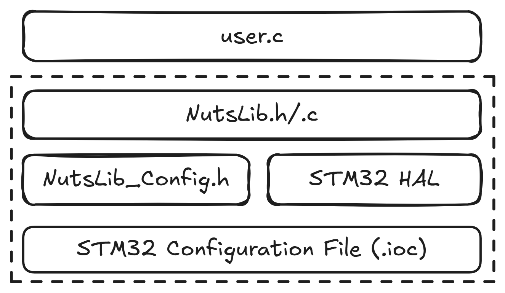

# NutsLib Reference Manual

# Chapter 1 概览

## 介绍

NutsLib 模块旨在为Nuts（被测芯片）与 Cracker（测试设备）提供简单易用的通信功能，支持 UART、SPI、I2C 等多种通信协议，并为使用不同芯片的 Nuts 提供一个标准的软件接口，方便用户专注于核心功能开发。

项目开源地址：https://github.com/HUANsic/Cracknuts-Nuts-STM32

## 特性

- 提供统一命令
  - Nut_Init(void)
  - Nut_Loop(void)
  - Nut_Quiet(void)
  - Nut_Unquiet(void)
  - Nut_Trigger_Set(void)
  - Nut_Trigger_Clear(void)
  - Nut_IO_1(bool)
  - Nut_IO_2(bool)
  - Nut_IO_3(bool)
  - Nut_IO_USER(bool)

- 支持硬件列表
  - NUT_F103C8TX
  - NUT_F407VGTX
  - NUT_F439VGTX
  - NUT_L476RGTX
  - NUT_L486RGTX

# Chapter 2 功能描述

用户在STM32配置文件（.ioc）中分配引脚及外设后，需要在NutsLib_Config.h中进行定义。

# Chapter 3 如何使用

## 项目建立过程

以F103为例

1. 克隆github仓库
2. CubeSTM32导入工程
3. 编译
4. 下载

WorkSpace说明，F103、L476、F407、F439、共享目录之间关系，举例说明个性和共性

## 通信协议

通信协议说明，CMD+Payload，status+payload

命令解析执行流程，给出流程图

## mbedtls介绍

# Chapter 4 设计流程

1. 定义命令
2. 明确收发数据长度
3. 增加功能函数
4. 返回数据及状态

# Chapter 5 示例

## 用户功能示例

以echo功能为例，Trigger

## GPIO控制示例

微信里用户提出的问题

# Chapter6 进阶功能

- STM32配置时钟

- 改变时钟频率，采集曲线，细节展示

- 改为外部时钟，采集曲线，细节展示

- STM32配置Cache功能示例

# 附录

## 不同Nut的管脚配置

个性：不同Nut对应的管脚配置

